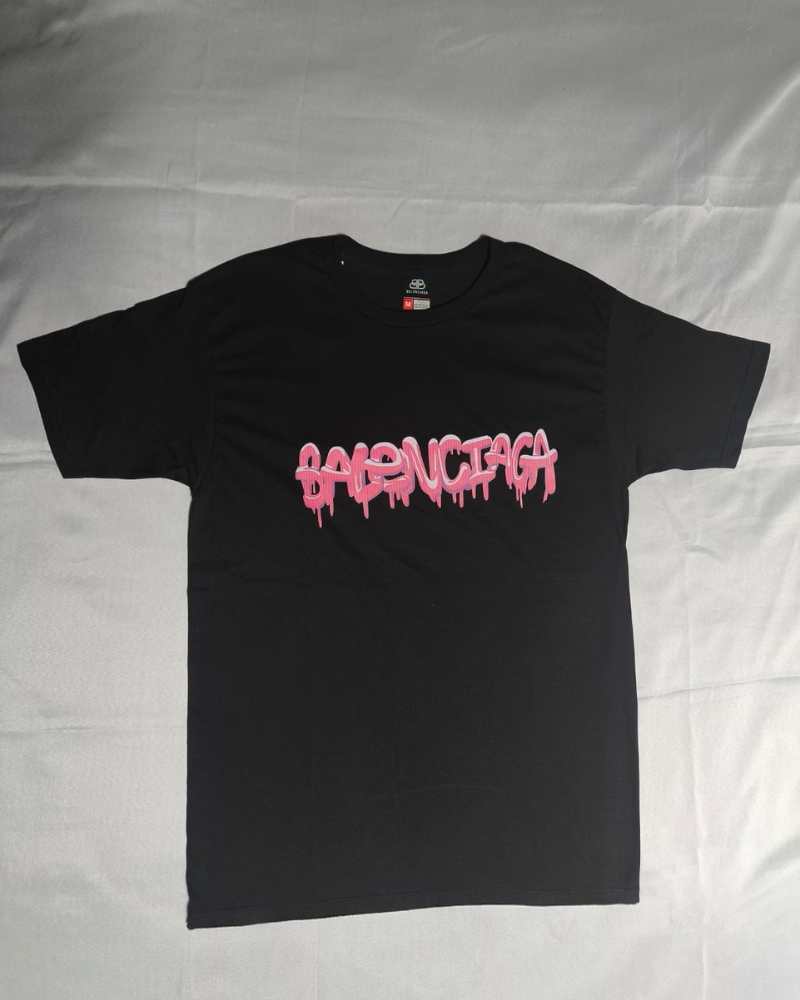
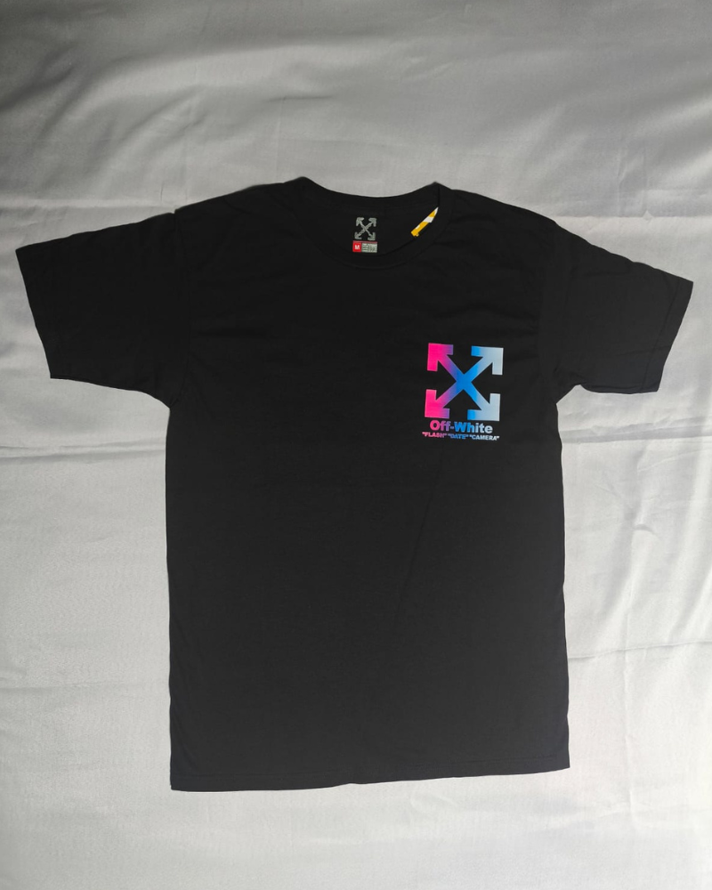
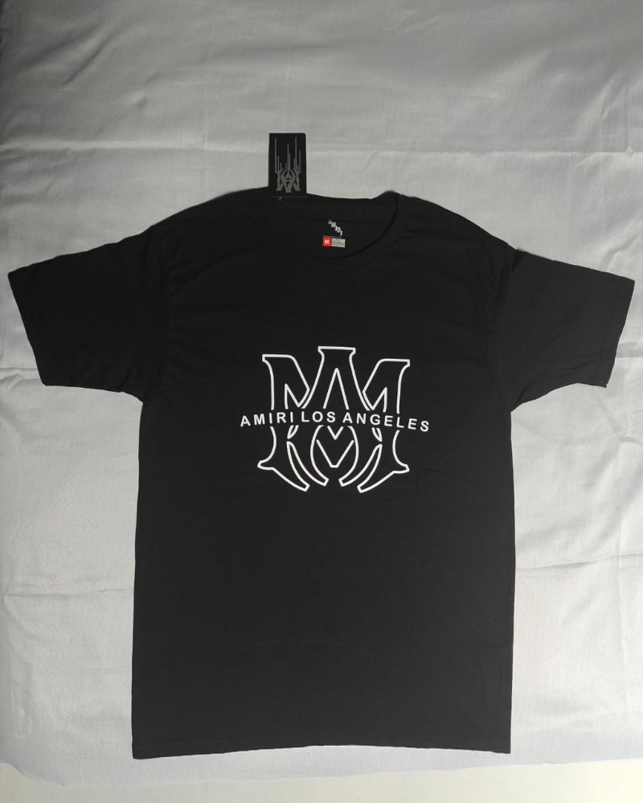
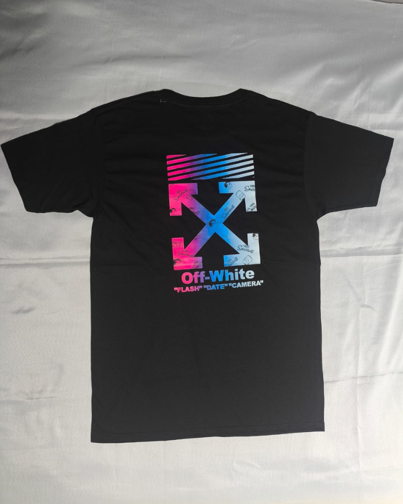

# 🛍️ JB StreetWear - Sitio Web Oficial

Sitio web de comercio electrónico para JB StreetWear, marca de moda urbana especializada en playeras de alta calidad con diseños exclusivos.


## 📋 Tabla de Contenidos

- [Características](#-características)
- [Instalación](#-instalación)
- [Guía de Uso](#-guía-de-uso)
  - [Agregar Productos](#agregar-productos)
  - [Productos Agotados](#productos-agotados)
  - [Productos en Oferta](#productos-en-oferta)
  - [Tallas No Disponibles](#tallas-no-disponibles)
  - [Carrusel de Imágenes](#carrusel-de-imágenes)
- [Estructura del Proyecto](#-estructura-del-proyecto)
- [Personalización](#-personalización)
- [Contacto](#-contacto)

## ✨ Características

- 🎨 **Diseño Moderno**: Interfaz elegante con paleta de colores dorado/negro
- 📱 **Responsive**: Totalmente adaptable a dispositivos móviles, tablets y desktop
- 🖼️ **Carrusel de Imágenes**: Visualización múltiple de productos
- 🏷️ **Sistema de Badges**: Indicadores visuales para ofertas y productos agotados
- 📐 **Gestión de Tallas**: Control visual de disponibilidad por talla
- 🔄 **Animaciones Suaves**: Efectos de scroll y hover profesionales
- 📧 **Contacto Directo**: Links funcionales a WhatsApp, Email e Instagram

## 🚀 Instalación

1. **Clona el repositorio:**
```bash
git clone https://github.com/tu-usuario/jb-streetwear.git
cd jb-streetwear
```

2. **Estructura de archivos necesaria:**
```
jb-streetwear/
│
├── index.html
├── LogoJB.png
├── favicon.png
├── Playera1.png
├── Playera2.png
├── Playera2_2.png
├── Playera3.png
├── Playera3_2.png
├── ...
└── README.md
```

3. **Abre el sitio:**
- Simplemente abre `index.html` en tu navegador
- O usa un servidor local como Live Server en VS Code

## 📖 Guía de Uso

### Agregar Productos

#### Producto Básico (Sin Carrusel)

```html
<div class="product-card">
    <div class="product-image">
        
    </div>
    <div class="product-info">
        <h3>Nombre del Producto</h3>
        <p>Descripción del producto aquí...</p>
        
        <div class="product-details">
            <div class="product-detail-item">
                <strong>Material:</strong>
                <span class="material-badge">100% Algodón</span>
            </div>
            <div class="product-detail-item">
                <strong>Tallas:</strong>
                <div class="sizes-container">
                    <span class="size-badge">S</span>
                    <span class="size-badge">M</span>
                    <span class="size-badge">L</span>
                    <span class="size-badge">XL</span>
                </div>
            </div>
        </div>
        
        <div class="price">$199.99 MXN</div>
    </div>
</div>
```

### Productos Agotados

Para marcar un producto como **AGOTADO**, agrega la clase `out-of-stock` al contenedor principal y el badge correspondiente:

```html
<div class="product-card out-of-stock">
    <span class="out-of-stock-badge">AGOTADO</span>
    
    <div class="product-image">
        
    </div>
    <div class="product-info">
        <!-- ... resto del contenido ... -->
    </div>
</div>
```

**Efectos visuales:**
- ✅ Badge rojo en esquina superior derecha
- ✅ Overlay oscuro sobre la imagen
- ✅ Opacidad reducida del producto completo
- ✅ Rotación sutil del badge para llamar la atención

**Personalización del texto:**
```html
<!-- Opciones de texto -->
<span class="out-of-stock-badge">AGOTADO</span>
<span class="out-of-stock-badge">SIN STOCK</span>
<span class="out-of-stock-badge">PRÓXIMAMENTE</span>
```

### Productos en Oferta

Para mostrar un producto **EN OFERTA** con precio reducido:

```html
<div class="product-card">
    <span class="sale-badge">¡OFERTA!</span>
    
    <div class="product-image">
        
    </div>
    <div class="product-info">
        <h3>Nombre del Producto</h3>
        <p>Descripción del producto...</p>
        
        <div class="product-details">
            <!-- ... detalles del producto ... -->
        </div>
        
        <!-- Precios en oferta -->
        <div class="price-container">
            <div class="price original">$199.99 MXN</div>
            <div class="price sale">$149.99 MXN</div>
            <span class="discount-percentage">-25%</span>
        </div>
    </div>
</div>
```

**Componentes del sistema de ofertas:**
- ✅ Badge verde `¡OFERTA!` en esquina superior izquierda
- ✅ Precio original tachado
- ✅ Precio en oferta verde brillante con efecto glow
- ✅ Badge de porcentaje de descuento
- ✅ Animación de pulso en badge y precio

**Personalización del descuento:**
```html
<span class="discount-percentage">-25%</span>
<span class="discount-percentage">-50%</span>
<span class="discount-percentage">2x1</span>
```

### Tallas No Disponibles

Para marcar tallas específicas como **NO DISPONIBLES**, agrega la clase `unavailable`:

```html
<div class="sizes-container">
    <span class="size-badge unavailable">S</span>  <!-- Agotada -->
    <span class="size-badge">M</span>              <!-- Disponible -->
    <span class="size-badge">L</span>              <!-- Disponible -->
    <span class="size-badge unavailable">XL</span> <!-- Agotada -->
</div>
```

**Efectos visuales:**
- ✅ Línea diagonal roja tachando la talla
- ✅ Color atenuado y opacidad reducida
- ✅ Cursor "not-allowed" al pasar el mouse
- ✅ Sin efecto hover

### Carrusel de Imágenes

Para productos con **múltiples imágenes**:

```html
<div class="product-card">
    <div class="product-image carousel" data-index="0">
        <button class="carousel-btn prev" aria-label="Imagen anterior">‹</button>
        
        <div class="carousel-track">
            
            
            <!-- Agrega más imágenes según necesites -->
        </div>
        
        <button class="carousel-btn next" aria-label="Imagen siguiente">›</button>
        
        <div class="carousel-indicators">
            <span class="carousel-indicator active"></span>
            <span class="carousel-indicator"></span>
            <!-- Un indicador por cada imagen -->
        </div>
    </div>
    
    <div class="product-info">
        <!-- ... resto del contenido ... -->
    </div>
</div>
```

**Características del carrusel:**
- ✅ Botones de navegación (anterior/siguiente)
- ✅ Indicadores visuales de posición
- ✅ Transiciones suaves
- ✅ Navegación por click en indicadores
- ✅ Compatible con cualquier número de imágenes

## 📁 Estructura del Proyecto

```
jb-streetwear/
│
├── index.html              # Página principal
├── LogoJB.png             # Logo de la marca
├── favicon.png            # Icono del sitio
│
├── Productos/             # Imágenes de productos
│   ├── Playera1.png
│   ├── Playera2.png
│   ├── Playera2_2.png     # Segunda imagen para carrusel
│   └── ...
│
└── README.md              # Este archivo
```

## 🎨 Personalización

### Colores de la Marca

Los colores principales están definidos en CSS:

```css
/* Dorado principal */
#d4a574

/* Dorado claro (hover) */
#f4c794

/* Negro principal */
#0a0a0a

/* Negro secundario */
#1a1a1a
```

### Modificar Información de Contacto

Busca la sección `#contacto` en el HTML y actualiza:

```html
<!-- WhatsApp -->
<a href="https://wa.me/5213411463794" target="_blank">
    +52 341 146 3794
</a>

<!-- Email -->
<a href="mailto:jbstreetwear.mx@gmail.com">
    jbstreetwear.mx@gmail.com
</a>

<!-- Instagram -->
<a href="https://www.instagram.com/jbstreetwear.mx" target="_blank">
    @jbstreetwear.mx
</a>
```

### Agregar/Modificar Productos

Los productos están en la sección con `id="catalogo"`. Sigue las estructuras documentadas arriba para agregar nuevos productos o modificar existentes.

## 🔄 Casos de Uso Combinados

### Producto en Oferta con Tallas Agotadas

```html
<div class="product-card">
    <span class="sale-badge">¡OFERTA!</span>
    
    <div class="product-image">
        
    </div>
    <div class="product-info">
        <h3>Nombre del Producto</h3>
        <p>Descripción...</p>
        
        <div class="product-details">
            <div class="product-detail-item">
                <strong>Material:</strong>
                <span class="material-badge">100% Algodón</span>
            </div>
            <div class="product-detail-item">
                <strong>Tallas:</strong>
                <div class="sizes-container">
                    <span class="size-badge unavailable">S</span>
                    <span class="size-badge">M</span>
                    <span class="size-badge">L</span>
                    <span class="size-badge unavailable">XL</span>
                </div>
            </div>
        </div>
        
        <div class="price-container">
            <div class="price original">$199.99 MXN</div>
            <div class="price sale">$149.99 MXN</div>
            <span class="discount-percentage">-25%</span>
        </div>
    </div>
</div>
```

### Producto Agotado (No mostrar precios)

```html
<div class="product-card out-of-stock">
    <span class="out-of-stock-badge">AGOTADO</span>
    
    <div class="product-image">
        
    </div>
    <div class="product-info">
        <h3>Nombre del Producto</h3>
        <p>Descripción...</p>
        
        <div class="product-details">
            <div class="product-detail-item">
                <strong>Material:</strong>
                <span class="material-badge">100% Algodón</span>
            </div>
            <div class="product-detail-item">
                <strong>Tallas:</strong>
                <div class="sizes-container">
                    <span class="size-badge unavailable">S</span>
                    <span class="size-badge unavailable">M</span>
                    <span class="size-badge unavailable">L</span>
                    <span class="size-badge unavailable">XL</span>
                </div>
            </div>
        </div>
        
        <!-- No mostrar precio para productos completamente agotados -->
    </div>
</div>
```

## 📞 Contacto

**JB StreetWear**

- 📱 WhatsApp: [+52 341 146 3794](https://wa.me/5213411463794)
- 📧 Email: [jbstreetwear.mx@gmail.com](mailto:jbstreetwear.mx@gmail.com)
- 📸 Instagram: [@jbstreetwear.mx](https://www.instagram.com/jbstreetwear.mx)
- 📍 Ubicación: Ciudad Guzmán, Jalisco, México

---

## 📄 Licencia

© 2026 JB StreetWear. Todos los derechos reservados.

---

## 🤝 Contribuciones

Este es un proyecto privado de JB StreetWear. Para sugerencias o reportar problemas, contacta directamente a través de los canales oficiales.

---

**Hecho con ❤️ y pasión por la moda urbana**
